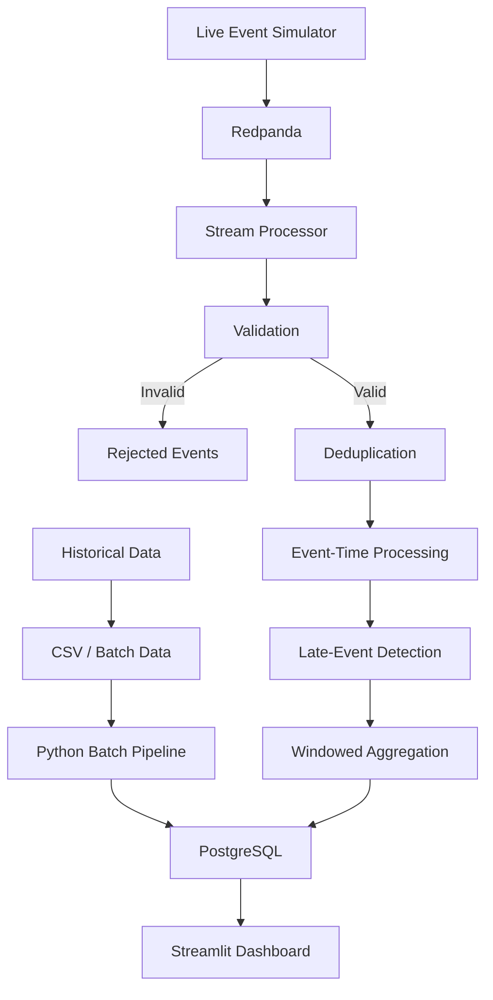

# Supply Chain Near-Real-Time Data Pipeline

A data engineering pipeline that combines historical batch processing with near-real-time supply-chain event processing.

The system simulates orders, shipments, and inventory events, processes them through Redpanda, validates and transforms the events, stores analytics in PostgreSQL, and exposes operational metrics through a live Streamlit dashboard.

## Architecture



## Problem

Supply-chain systems continuously receive events from multiple operational sources.

In practice, these events may contain:

- Invalid timestamps
- Missing identifiers
- Invalid quantities or prices
- Unknown event types
- Duplicate events
- Late-arriving events
- Temporary processing failures

A pipeline should not stop processing valid data simply because individual events are invalid or arrive late.

This project demonstrates how these situations can be handled in a lightweight streaming architecture.

## What the Pipeline Does

### 1. Historical Batch Processing

Historical CSV datasets containing:

- Orders
- Shipments
- Products
- Inventory
- Suppliers

are processed using Python/pandas.

The batch pipeline performs transformations such as:

- Deduplication
- Data type conversion
- Order-value calculation
- Shipment performance calculations
- Inventory health classification

The resulting analytical tables are stored in PostgreSQL.

### 2. Near-Real-Time Event Simulation

A Python producer continuously generates simulated supply-chain events:

- `ORDER_PLACED`
- `SHIPMENT_CREATED`
- `INVENTORY_RECEIPT`

Events are published to Redpanda.

The simulator also intentionally generates invalid and late events so that pipeline reliability can be tested.

### 3. Data Quality

The streaming processor validates incoming events before processing them.

Examples of rejected events include:

- Missing `event_id`
- Invalid `event_type`
- Invalid `event_time`
- Invalid order quantity
- Invalid unit price

Invalid events are stored in PostgreSQL's `rejected_events` table rather than crashing the pipeline.

### 4. Event-Time Processing

The processor uses event timestamps rather than simply relying on processing time.

Streaming data is aggregated into **10-second event-time windows**.

Late-arriving events are detected using an allowed-lateness threshold.

### 5. Deduplication

Events are tracked using their event identifiers to prevent duplicate events from being processed repeatedly during the active processor session.

> **Note:** Deduplication state is currently maintained in memory and is not persistent across processor restarts.

### 6. Observability

The pipeline records operational metrics including:

- Processed events
- Invalid events
- Late events

These metrics are stored in PostgreSQL and displayed in the Streamlit dashboard.

### 7. Failure Recovery

The streaming processor was tested by intentionally stopping it while the producer continued generating events.

After restarting the processor, queued events were consumed and processing resumed.

Example test:

```text
Before processor interruption: 2610 processed events
After processor restart:       2654 processed events
Events processed after restart: 44
```

This demonstrates recovery from a consumer interruption without requiring the producer or Redpanda broker to be restarted.

## Dashboard

The Streamlit dashboard provides:

- Live processed-event count
- Live order and shipment metrics
- Live order value
- Late-event count
- Rejected-event count
- Inventory alerts
- Streaming window analytics
- Historical order analytics
- Delivery performance
- Pipeline health metrics

The dashboard refreshes automatically so that streaming metrics update while the processor is running.

## Technology Stack

| Component | Technology |
|---|---|
| Language | Python |
| Streaming broker | Redpanda |
| Batch processing | pandas |
| Database | PostgreSQL |
| Dashboard | Streamlit |
| Visualization | Plotly |
| Containerization | Docker Compose |

## Project Structure

```text
data_pipeline/
│
├── ingestion/
│   ├── generate_data.py
│   └── kafka_producer.py
│
├── processing/
│   ├── batch_pipeline.py
│   └── stream_processor.py
│
├── dashboard/
│   └── app.py
│
├── warehouse/
│   └── schema/
│       └── init.sql
│
├── data/
│   └── sample/
│       ├── orders.csv
│       ├── shipments.csv
│       ├── inventory.csv
│       ├── products.csv
│       ├── suppliers.csv
│       └── warehouses.csv
│
├── config/
│   ├── pipeline_config.yaml
│   └── data_dictionary.md
│
├── kafka/
│   └── topics.py
│
├── sql/
│   ├── delivery_analysis.sql
│   ├── inventory_analysis.sql
│   └── supplier_analysis.sql
│
├── tests/
│   └── test_pipeline.py
│
├── docker-compose.yml
├── requirements.txt
└── README.md
```

## Running the Project

### 1. Start Infrastructure

```bash
docker compose up -d
```

This starts:

- PostgreSQL
- Redpanda

### 2. Generate Historical Data

```bash
python ingestion/generate_data.py
```

### 3. Run the Batch Pipeline

```bash
python processing/batch_pipeline.py
```

### 4. Start the Streaming Processor

```bash
python processing/stream_processor.py
```

### 5. Start the Event Simulator

In another terminal:

```bash
python ingestion/kafka_producer.py
```

### 6. Start the Dashboard

In another terminal:

```bash
streamlit run dashboard/app.py
```

The dashboard then displays the historical and streaming pipeline results.

## Reliability Testing

The project includes deliberate fault-injection tests.

### Invalid Data

The event simulator generates invalid events to test:

- Timestamp validation
- Required-field validation
- Event-type validation
- Quantity validation
- Price validation

Rejected events are persisted instead of terminating the stream processor.

### Late Events

The simulator generates events with older event timestamps to test event-time processing and late-event detection.

### Processor Failure

The stream processor can be stopped while the producer continues sending events.

After restarting the processor, queued events are consumed and processing resumes.

## Limitations

This project intentionally prioritizes a lightweight local architecture.

Current limitations include:

- Event source is simulated rather than connected to a production operational system.
- Deduplication state is maintained in memory.
- The system is designed for local development rather than high-scale production workloads.
- Redpanda and PostgreSQL run as lightweight Docker services.
- Streaming processing is implemented in Python rather than a distributed stream-processing framework.

## Key Engineering Concepts Demonstrated

- Batch vs. streaming processing
- Event-time processing
- Late-arriving data
- Data-quality validation
- Event deduplication
- Fault recovery
- Pipeline observability
- Windowed aggregation
- Analytical data modeling
- PostgreSQL persistence
- Containerized infrastructure
- Operational dashboards
